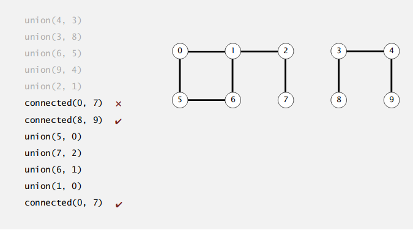

# QUICK FIND

Quick Find Algorithm
[0, 1, 2, 3, 4, 5, 6, 7, 8, 9, 10]

union(2, 3)
[0, 1, 3, 3, 4, 5, 6, 7, 8, 9, 10]

union(5, 3)
[0, 1, 3, 3, 4, 3, 6, 7, 8, 9, 10]

union(3, 6)
[0, 1, 6, 6, 4, 6, 6, 7, 8, 9, 10]

connected(5, 1)
false

connected(2, 5)
true

Check if there is a union or a path between two objects/points

__Implementation__
- The find query: checeking if two objects are connected
- The union command: connecting two components

__Applications__

・Pixels in a digital photo.
・Computers in a network.
・Friends in a social network.
・Transistors in a computer chip.
・Elements in a mathematical set.
・Variable names in Fortran program.
・Metallic sites in a composite system.

__Implementation__
* Quick sort
  - The union command is very slow (loops round)